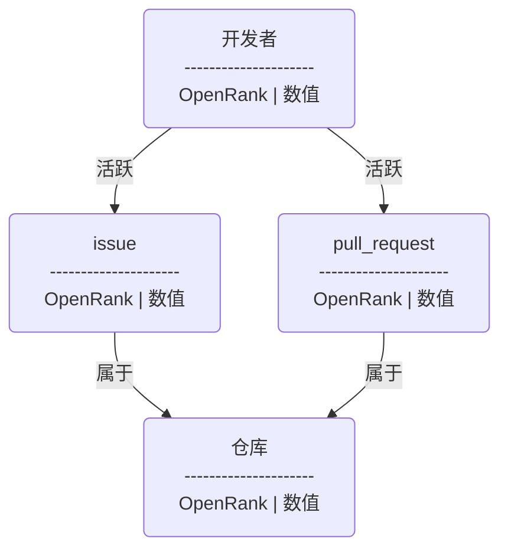

# 社区 OpenRank

 

## 定义

社区 OpenRank 是一个由 X-lab 开放实验室提出的开源指标，该指标由赵生宇博士提出，关于项目 OpenRank 的算法细节可以参考[这篇博客](https://blog.frankzhao.cn/openrank_in_project/)。

与全域 OpenRank 指标的计算方法类似，该算法使用项目内的 Issue、PR 等协作数据来构建网络，其网络模型为：

 

## 代码

这里是 [**实现代码**](https://github.com/X-lab2017/open-digger/blob/master/src/cron/tasks/community_openrank.ts)。

其底层使用的用于计算通用 OpenRank 的 Neo4j [插件项目](https://github.com/X-lab2017/openrank-neo4j-gds)已经开源，欢迎大家使用。

## 参数

项目 OpenRank 相较于全域 OpenRank 更加复杂，包含较多参数：

| 参数名 | 值 | 描述 | 注 |
| :------------- | :---- | :---------- | :--- |
| 开发者/仓库 OpenRank 默认值 | 1.0 | 网络中开发者与仓库的 OpenRank 默认值，例如新加入社区的开发者或新仓库 | |
| Issue OpenRank 默认值 | 2.0 | 网络中 Issue 节点的 OpenRank 默认值 | |
| 未合入 PR OpenRank 默认值 | 3.0 | 网络中未合入的 PR 节点的 OpenRank 默认值 | |
| 已合入 PR OpenRank 默认值 | 5.0 | 网络中已合入的 PR 节点的 OpenRank 默认值 | |
| 开发者/仓库继承比例 | 0.15 | 网络中开发者/仓库节点对上月历史 OpenRank 或初始 OpenRank 的继承比例 | 项目内 OpenRank 中，开发者的价值更应依赖于当月的活跃情况 |
| Issue/PR 继承比例 | 0.8 | 网络中 Issue/PR 节点对上个月历史 OpenRank 或初始 OpenRank 的继承比例 | Issue/PR 的价值应当相对稳定且更依赖于自身的价值 |
| OpenRank 衰减系数 | 0.8 | 对于当月不活跃开发者/Issue/PR 的 OpenRank 衰减比例 | 网络中各节点的 OpenRank 不应在当月不活跃后立即清零 |
| OpenRank 最小值 | 0.1 | 当网络中节点 OpenRank 值衰减至该值以下时将清零 | |
| Issue/PR 节点延属于边流向仓库节点的 OpenRank 比例 | 0.1 | Issue/PR 节点的 OpenRank 有多少比例转移到仓库节点 | |
| 仓库节点延属于边流向 Issue/PR 节点的 OpenRank 比例 | 平均 | 仓库节点的 OpenRank 将平均分配到所有 Issue/PR 节点 | |
| Issue/PR 节点延活跃边流向开发者节点的 OpenRank 比例 | 0.9 | Issue/PR 节点的 OpenRank 有多少比例转移到开发者节点 | |
| 开发者节点延活跃边流向 Issue/PR 节点的 OpenRank 比例 | 1.0 | 开发者节点的 OpenRank 有多少比例转移到 Issue/PR 节点 | |
| `发起`动作活跃比例 | 0.5 | Issue/PR 的价值有多少将转移到其作者 | Issue/PR 作者将优先获取其 50% 的价值，剩余 50% 由其他参与者获得 |
| `发起`/`评论`/`Review`/`关闭` 动作权重 | 2/1/1/2 | 用于计算活跃边权重时各类事件的权重 | |
| 👍/❤️/🚀 表情权重 | 2/3/4 | 用于计算 Issue/PR 初始 OpenRank 的表情的权重 | Issue/PR 的初始 OpenRank 将由其社区中开发者对其添加的表情所决定 |
