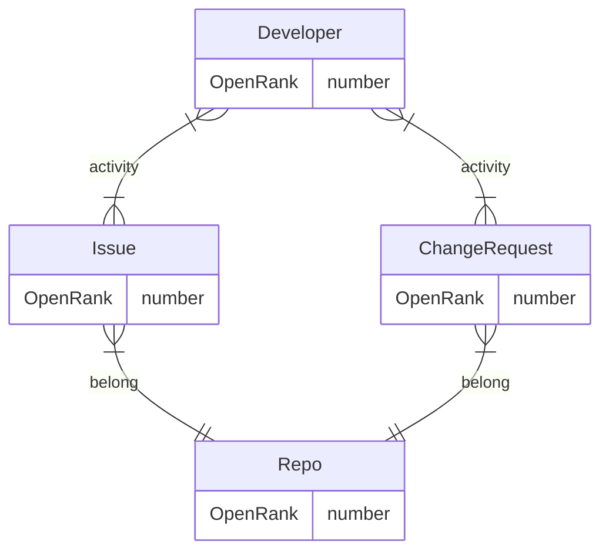

# Community OpenRank

 

## Definition

Community OpenRank is an open-source metric proposed by Dr. Shengyu Zhao from the X-lab Open Laboratory. For detailed algorithm specifications, please refer to[this blog post](https://blog.frankzhao.cn/openrank_in_project/)。

Similar to the global OpenRank metric, this algorithm constructs a network using project collaboration data such as Issues and PRs. The network model is:

## Code

The Community OpenRank algorithm implementation has not yet been open-sourced in OpenDigger. However, the underlying Neo4j [plugin project](https://github.com/X-lab2017/openrank-neo4j-gds) used for calculating general OpenRank is already open-source and ready for use.

## Parameters

Community OpenRank is more complex than global OpenRank and includes several parameters:

| Parameter Name | Value | Description | Notes |
| :------------- | :---- | :---------- | :--- |
| Default OpenRank for Developer/Repo | 1.0 | The default OpenRank value for developers and repositories in the network, such as new community members or new repositories | |
| Default OpenRank for Issue | 2.0 | The default OpenRank value for Issue nodes in the network | |
| Default OpenRank for Unmerged PR | 3.0 | The default OpenRank value for unmerged PR nodes in the network | |
| Default OpenRank for Merged PR | 5.0 | The default OpenRank value for merged PR nodes in the network | |
| Developer/Repo Inheritance Ratio | 0.15 | The proportion of a developer's/repository's OpenRank inherited from last month's historical OpenRank or initial OpenRank | In project OpenRank, a developer's value should depend more on their current month's activity |
| Issue/PR Inheritance Ratio | 0.8 | The proportion of an Issue's/PR's OpenRank inherited from last month's historical OpenRank or initial OpenRank | The value of Issues/PRs should remain relatively stable and depend more on their own value |
| OpenRank Decay Coefficient | 0.8 | The decay ratio for inactive developers/Issues/PRs in the current month | Nodes' OpenRank should not be immediately reset to zero after a month of inactivity |
| Minimum OpenRank Value | 0.1 | The threshold below which a node's OpenRank will be reset to zero | |
| Proportion of Issue/PR OpenRank flowing to Repo along "belong" edge | 0.1 | How much of an Issue's/PR's OpenRank is transferred to its repository | |
| Proportion of Repo OpenRank flowing to Issue/PR along "belong" edge | Average | The repository's OpenRank is evenly distributed among all its Issues/PRs | |
| Proportion of Issue/PR OpenRank flowing to Developer along "activity" edge | 0.9 | How much of an Issue's/PR's OpenRank is transferred to its contributing developers | |
| Proportion of Developer OpenRank flowing to Issue/PR along "activity" edge | 1.0 | How much of a developer's OpenRank is transferred to the Issues/PRs they contribute to | |
| "Initiate" action activity proportion | 0.5 | How much of an Issue's/PR's value is transferred to its author | The author receives 50% of the value, with the remaining 50% distributed among other participants |
| Weights for "Initiate"/"Comment"/"Review"/"Close" actions | 2/1/1/2 | The weights assigned to different event types when calculating activity edge weights | |
| Weights for 👍/❤️/🚀 reactions | 2/3/4 | The weights of reactions used to calculate the initial OpenRank of Issues/PRs | The initial OpenRank is determined by the community's reactions to the Issue/PR |
